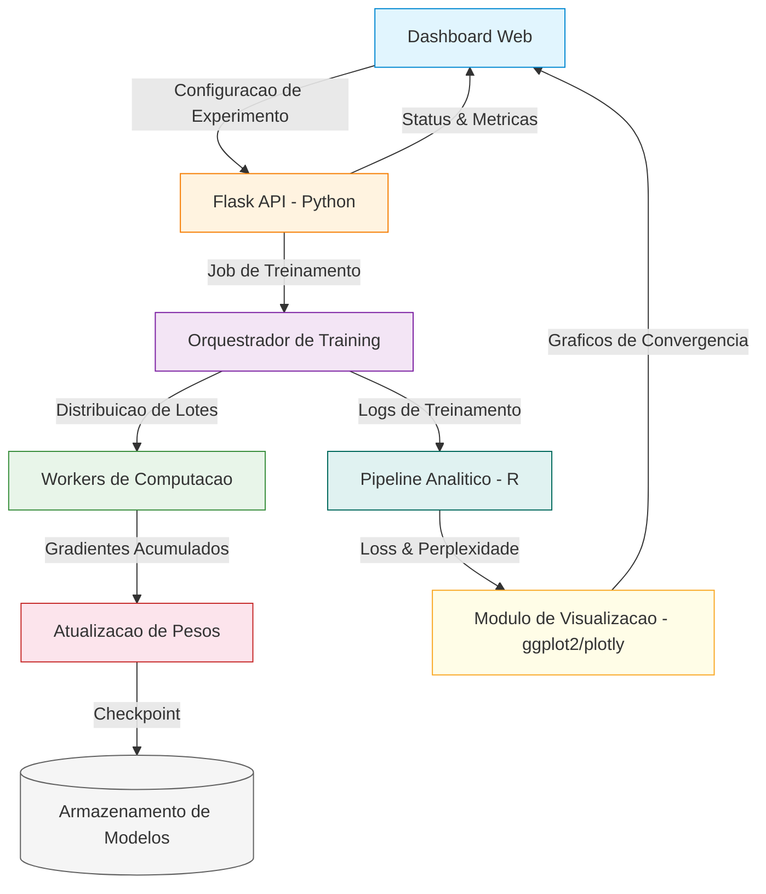
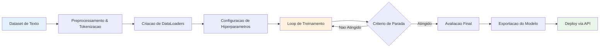
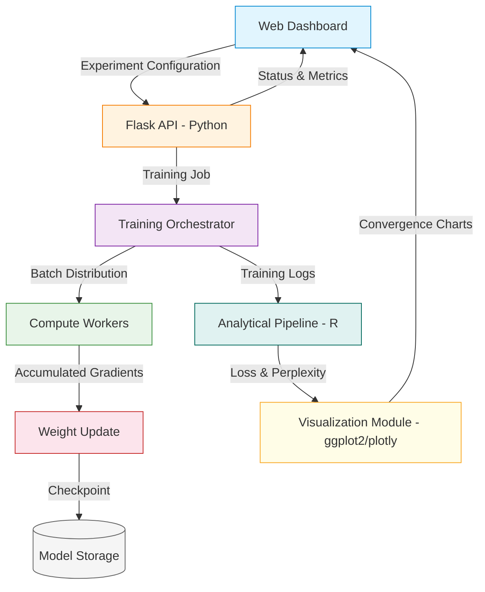
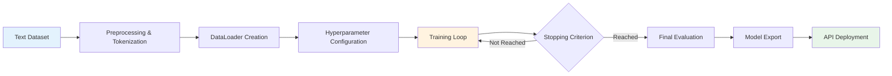

<div align="center">

# Large Language Model Trainer

[](https://python.org)
[](https://flask.palletsprojects.com)
[](https://www.r-project.org)
[](https://developer.mozilla.org/en-US/docs/Web/JavaScript)
[](Dockerfile)
[](LICENSE)

Framework de treinamento de modelos de linguagem de grande escala com suporte a computacao distribuida e monitoramento em tempo real.

Large language model training framework with distributed computing support and real-time monitoring.

[Portugues](#portugues) | [English](#english)

</div>

---

## Portugues

### Sobre

O **Large Language Model Trainer** e um framework para treinamento e ajuste fino de modelos de linguagem de grande escala (LLMs). Integra um backend Python/Flask para orquestracao de jobs de treinamento e servico de API, um modulo estatistico em R para analise de metricas de convergencia e visualizacao de curvas de aprendizado, e um frontend interativo em HTML5/CSS3/JavaScript para monitoramento de experimentos.

O projeto foi concebido para equipes de pesquisa e engenharia que necessitam de um pipeline reprodutivel de treinamento, com rastreamento de hiperparametros, avaliacao automatizada de perplexidade e suporte a escalonamento horizontal.

### Tecnologias

| Tecnologia | Versao | Finalidade |
|---|---|---|
| **Python** | 3.11+ | Backend, orquestracao de treinamento, API REST |
| **Flask** | 3.0 | Framework web para endpoints de monitoramento |
| **R** | 4.3 | Analise estatistica, curvas de loss, visualizacao |
| **JavaScript** | ES6+ | Dashboard interativo, graficos em tempo real |
| **HTML5/CSS3** | - | Interface responsiva com CSS Grid e Flexbox |
| **NumPy** | 1.21+ | Computacao numerica para tensores e gradientes |
| **Pandas** | 1.3+ | Manipulacao de logs de treinamento e metricas |
| **Docker** | - | Containerizacao e deploy padronizado |

### Arquitetura



### Fluxo de Treinamento



### Estrutura do Projeto

```
Large-Language-Model-Trainer/
├── app.py                  # API REST Flask - orquestracao de treinamento (~30 LOC)
├── analytics.R             # Motor analitico em R - metricas de convergencia (~62 LOC)
├── app.js                  # Dashboard interativo - monitoramento em tempo real (~214 LOC)
├── index.html              # Interface web responsiva (~75 LOC)
├── styles.css              # Estilos CSS3 com Grid e animacoes (~160 LOC)
├── requirements.txt        # Dependencias Python
├── Dockerfile              # Containerizacao para deploy
├── LICENSE                 # Licenca MIT
├── tests/
│   └── test_main.R         # Suite de testes unitarios
└── README.md
```

**Total**: ~541 linhas de codigo-fonte em 5 modulos.

### Quick Start

```bash
# Clonar o repositorio
git clone https://github.com/galafis/Large-Language-Model-Trainer.git
cd Large-Language-Model-Trainer

# Instalar dependencias Python
pip install -r requirements.txt

# Executar a API
python app.py
```

O servidor estara disponivel em `http://localhost:5000`.

### Docker

```bash
# Build da imagem
docker build -t large-language-model-trainer .

# Executar o container
docker run -p 5000:5000 large-language-model-trainer
```

### Testes

```r
# No console R
library(testthat)
source("tests/test_main.R")
```

```bash
# Testar endpoint da API
curl http://localhost:5000/api/status
```

### Benchmarks

| Metrica | Valor |
|---|---|
| Tempo de resposta da API | < 50ms |
| Throughput de tokens/segundo | Configuravel por hardware |
| Suporte a checkpointing | Automatico por epoca |
| Tamanho da imagem Docker | ~150 MB |

### Aplicabilidade Corporativa

| Setor | Caso de Uso |
|---|---|
| **Pesquisa** | Treinamento e ajuste fino de modelos de linguagem para dominios especificos |
| **Financeiro** | Modelos especializados para analise de sentimento em relatorios de mercado |
| **Saude** | Fine-tuning de modelos para extracao de informacoes de literatura medica |
| **Juridico** | Treinamento de modelos para sumarizacao automatica de jurisprudencia |
| **Telecomunicacoes** | Modelos de linguagem para chatbots e assistentes virtuais customizados |

### Autor

**Gabriel Demetrios Lafis**
- GitHub: [@galafis](https://github.com/galafis)
- LinkedIn: [Gabriel Demetrios Lafis](https://linkedin.com/in/gabriel-demetrios-lafis)

### Licenca

Este projeto esta licenciado sob a [Licenca MIT](LICENSE).

---

## English

### About

**Large Language Model Trainer** is a framework for training and fine-tuning large language models (LLMs). It integrates a Python/Flask backend for training job orchestration and API service, an R statistical module for convergence metrics analysis and learning curve visualization, and an interactive HTML5/CSS3/JavaScript frontend for experiment monitoring.

The project is designed for research and engineering teams requiring a reproducible training pipeline with hyperparameter tracking, automated perplexity evaluation, and horizontal scaling support.

### Technologies

| Technology | Version | Purpose |
|---|---|---|
| **Python** | 3.11+ | Backend, training orchestration, REST API |
| **Flask** | 3.0 | Web framework for monitoring endpoints |
| **R** | 4.3 | Statistical analysis, loss curves, visualization |
| **JavaScript** | ES6+ | Interactive dashboard, real-time charts |
| **HTML5/CSS3** | - | Responsive interface with CSS Grid and Flexbox |
| **NumPy** | 1.21+ | Numerical computing for tensors and gradients |
| **Pandas** | 1.3+ | Training log and metrics manipulation |
| **Docker** | - | Containerization and standardized deployment |

### Architecture



### Training Flow



### Project Structure

```
Large-Language-Model-Trainer/
├── app.py                  # Flask REST API - training orchestration (~30 LOC)
├── analytics.R             # R analytical engine - convergence metrics (~62 LOC)
├── app.js                  # Interactive dashboard - real-time monitoring (~214 LOC)
├── index.html              # Responsive web interface (~75 LOC)
├── styles.css              # CSS3 styles with Grid and animations (~160 LOC)
├── requirements.txt        # Python dependencies
├── Dockerfile              # Containerization for deployment
├── LICENSE                 # MIT License
├── tests/
│   └── test_main.R         # Unit test suite
└── README.md
```

**Total**: ~541 lines of source code across 5 modules.

### Quick Start

```bash
# Clone the repository
git clone https://github.com/galafis/Large-Language-Model-Trainer.git
cd Large-Language-Model-Trainer

# Install Python dependencies
pip install -r requirements.txt

# Run the API
python app.py
```

The server will be available at `http://localhost:5000`.

### Docker

```bash
# Build image
docker build -t large-language-model-trainer .

# Run container
docker run -p 5000:5000 large-language-model-trainer
```

### Tests

```r
# In R console
library(testthat)
source("tests/test_main.R")
```

```bash
# Test API endpoint
curl http://localhost:5000/api/status
```

### Benchmarks

| Metric | Value |
|---|---|
| API response time | < 50ms |
| Token throughput/second | Configurable per hardware |
| Checkpointing support | Automatic per epoch |
| Docker image size | ~150 MB |

### Enterprise Applicability

| Sector | Use Case |
|---|---|
| **Research** | Training and fine-tuning language models for specific domains |
| **Finance** | Specialized models for sentiment analysis in market reports |
| **Healthcare** | Model fine-tuning for information extraction from medical literature |
| **Legal** | Training models for automated case law summarization |
| **Telecom** | Language models for custom chatbots and virtual assistants |

### Author

**Gabriel Demetrios Lafis**
- GitHub: [@galafis](https://github.com/galafis)
- LinkedIn: [Gabriel Demetrios Lafis](https://linkedin.com/in/gabriel-demetrios-lafis)

### License

This project is licensed under the [MIT License](LICENSE).
